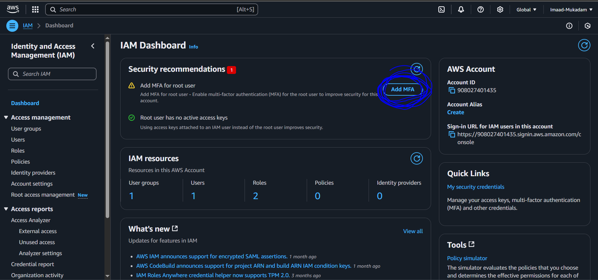
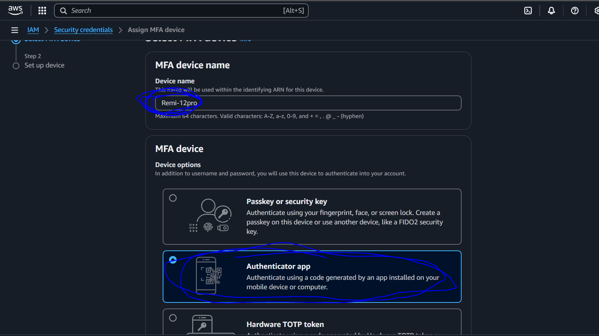
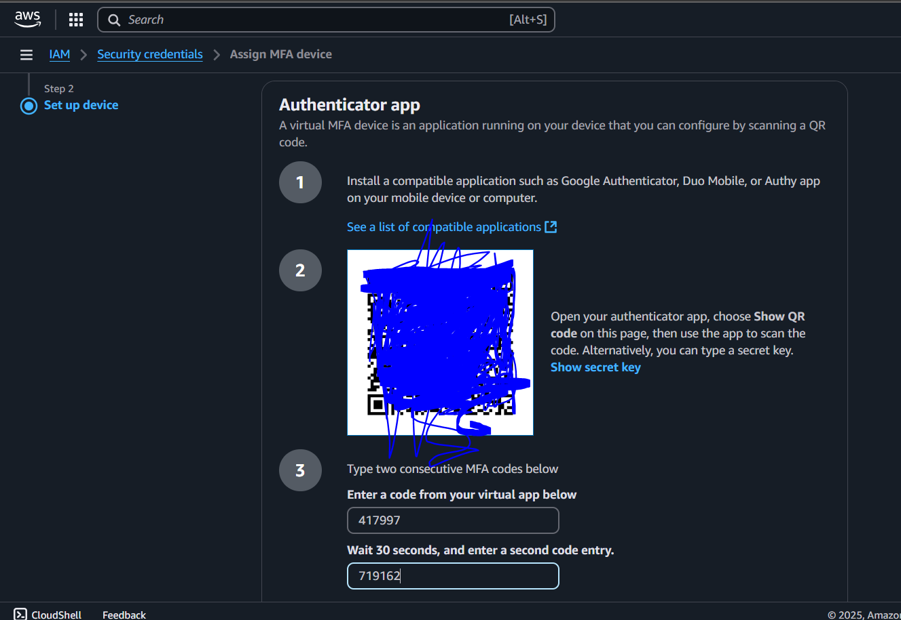

# AWS-MFA-Multi-Factor-Authentication

## Summary

### **AWS Multi-Factor Authentication (MFA)**  

AWS Multi-Factor Authentication (MFA) enhances security by requiring users to provide an additional authentication factor beyond their password. This extra layer of security helps protect AWS accounts from unauthorized access.  

#### **How It Works:**  
✅ Users sign in with their password (first factor)  
✅ They provide a time-based OTP (second factor) from an MFA device (e.g., Authenticator app, hardware key)  
✅ Access is granted only after both factors are verified  

#### **Benefits of AWS MFA:**  
🔹 Strengthens account security against credential theft  
🔹 Prevents unauthorized access, even if passwords are compromised  
🔹 Supports virtual, hardware, and FIDO security keys  

## Step - 1

i. Go in IAM Dashboard or Search for MFA 

ii. Now Click on Add MFA

## Step - 2 

i. Give your device name , and select your Authentication option , i'm doing MFA using Authenticator App (Download Duo Mobile from playstore in your mobile)

## Step - 3

i. Scan QR code from your mobile and provide otps

